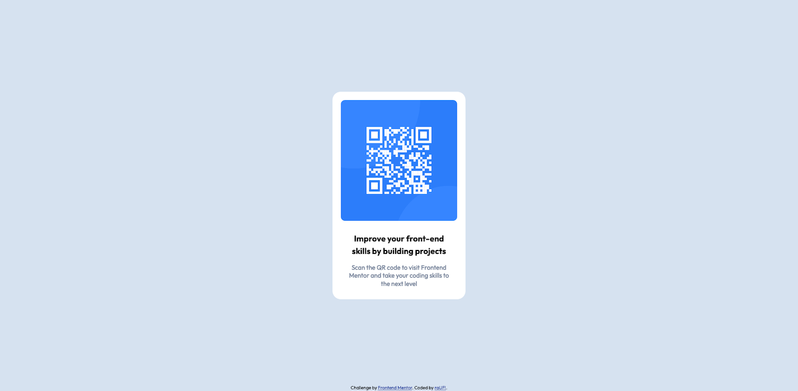

# Frontend Mentor - QR code component solution

This is a solution to the [QR code component challenge on Frontend Mentor](https://www.frontendmentor.io/challenges/qr-code-component-iux_sIO_H). 

## Table of contents

  - [Table of contents](#table-of-contents)
  - [Overview](#overview)
    - [Screenshot](#screenshot)
    - [Links](#links)
  - [My process](#my-process)
    - [Built with](#built-with)
    - [What I learned](#what-i-learned)
    - [Continued development](#continued-development)
    - [Useful resources](#useful-resources)
  - [Author](#author)
  - [Acknowledgments](#acknowledgments)

## Overview
Quick go at the QR code component challenge, non-responsive as per the cahllenge rules.

### Screenshot

| Mobile                                                                                | Desktop                                                                                 |
| ------------------------------------------------------------------------------------- | --------------------------------------------------------------------------------------- |
|  |  |

### Links

- Solution URL: [Add solution URL here](https://your-solution-url.com)
- Live Site URL: [https://rauf-dev.github.io/fm_qr-code-component/](https://rauf-dev.github.io/fm_qr-code-component/)

## My process
Gave the card a fixed width and height. All else inside the card is layed out using flex and padding.

### Built with

- Semantic HTML5 markup
- CSS custom properties
- Flexbox
- Mobile-first workflow

## Author

- Website - [raUF!](https://www.heyrauf.com)
- Frontend Mentor - [@raUF!](https://www.frontendmentor.io/profile/yourusername)

